{}

   Discuss the following questions:
      
   - What is a relational database?
   - What other types of databases are there?
   - Who can access a database?
   - What is the advantage of having a database in the cloud?
   - Which database managment systems have you heard of or used?

{}

## RDBMS

RDBMS or Relational Database Management Systems are software systems that enables users to define, create, maintain and control access to the database. Postgresql is a free and open-source RDBMS which uses SQL. Besides Postgresql there are many other ones as MySQL, SQLite, Oracle and many more.

Google cloud offers a service called **Cloud SQL**. It is an GCP service that hosts SQL databases in the cloud. Please follow the steps in the following challenge to set up a server containing a cloud database. This database will store the data for multiple projects during the bootcamp. 


{}

<style type="text/css">
    table.bdrless 
   td{
       border-width: 0px;
    }
    tr {
       border-bottom: 1px solid #bcd9f0;
    }   
</style>

<table class="bdrless" style="border-width: 0px">
   <tr>
    <td><b>1.</b></td>
    <td>Log into google cloud account.</td>
    <td><a href="https://cloud.google.com/">Google Cloud Platform</a></td>
   </tr>
   <tr>
    <td><b>2.</b></td>
    <td>In the toolbar click on <b>Console</b> in the upper right next to account initial.</td>
    <td>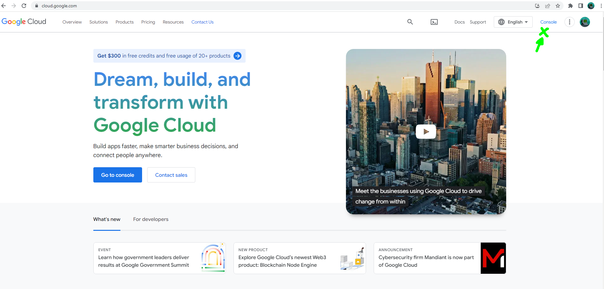</td>
   </tr>
   <tr>
    <td><b>3.</b></td>
    <td>In the upper left of the console there is a <i>hamburger</i> dropdown menu and the words <b>Google Cloud Platform</b>. To the right of these words there is the project menu. Click on <b>Select a project</b>.</td>
    <td>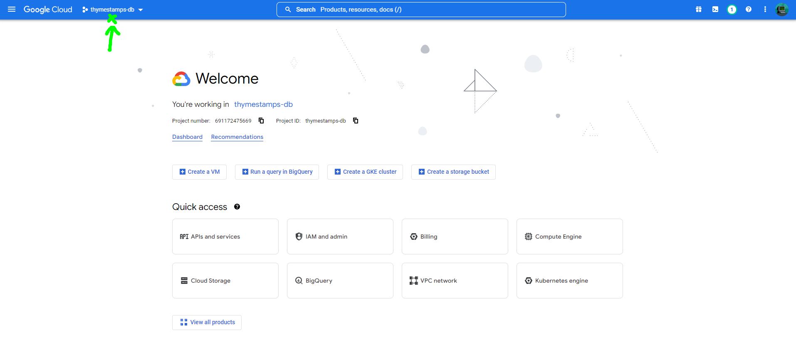</td>
   </tr>  
   <tr>
    <td><b>4.</b></td>
    <td>A menu should pop up. In the upper right corner of the menu click on <b>New Project</b>.</td>
    <td>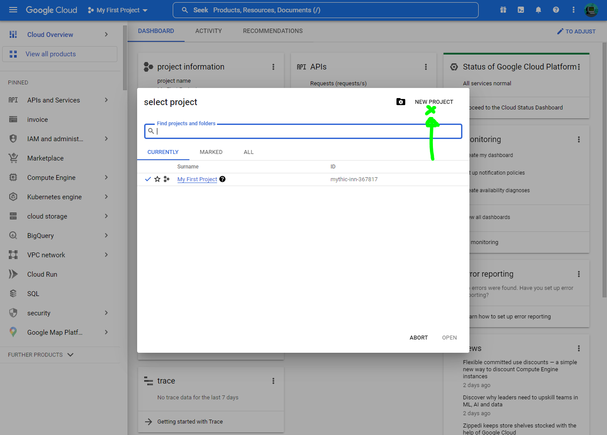</td>
   </tr>   
   <tr>
    <td><b>5.</b></td>
    <td>Fill out the form and click on <b>CREATE</b></td>
    <td>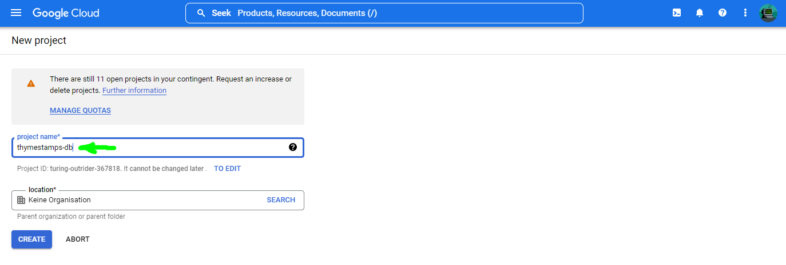</td>
   </tr> 
   <tr>
    <td rowspan="4" style="vertical-align: top"><b>6.</b></td>
    <td>Once the project has been created the browser has returned to the <b>Console view</b> ensure the project just created is shown in the menu next to <b>Google Cloud Platform</b>. If not then click on <b>Select a project</b> and select the project that was just created.</td>
    <td></td>
   </tr> 
   <tr>
    <td>check selected project</td>
    <td>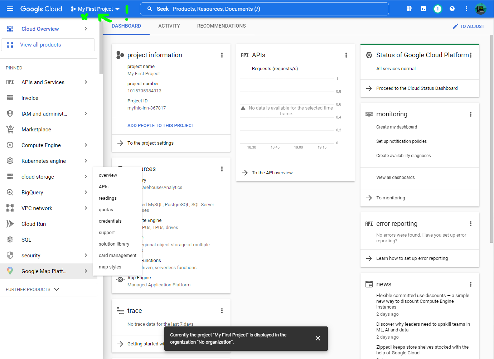</td>
   </tr> 
   <tr>
    <td>select the project</td>
    <td>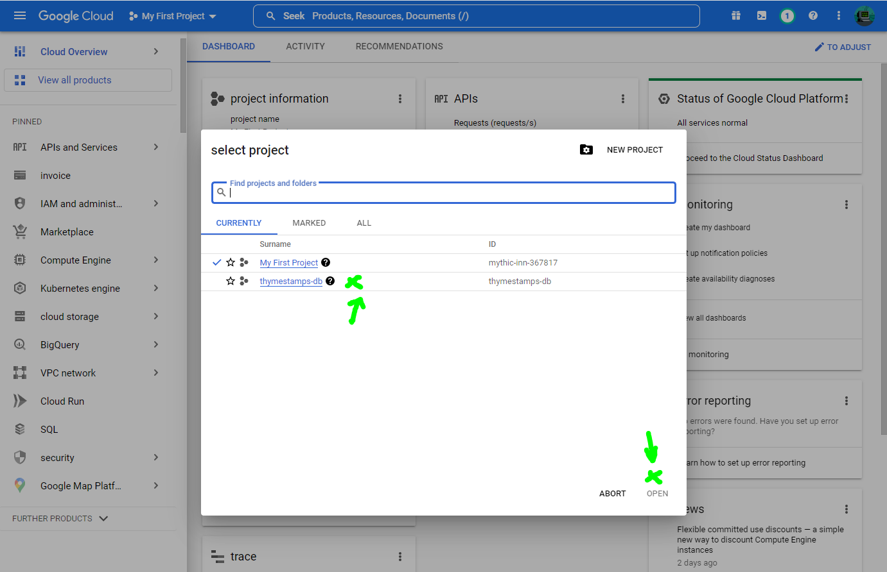</td>
   </tr> 
   <tr>
    <td>check selection again </td>
    <td>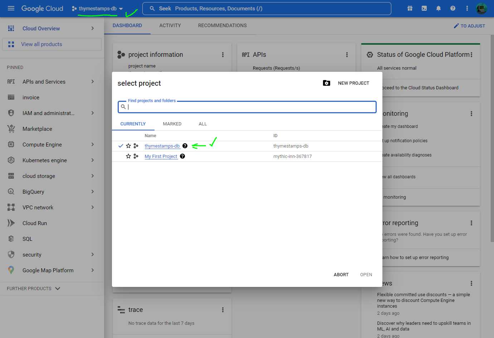</td>
   </tr> 
   <tr>
    <td><b>7.</b></td>
    <td>On the left side of the <b>Console</b> at the top there is the <b>Project Info</b> under this there is a menu called <b>Resources</b>. Click on <b>SQL</b>.</td>
    <td>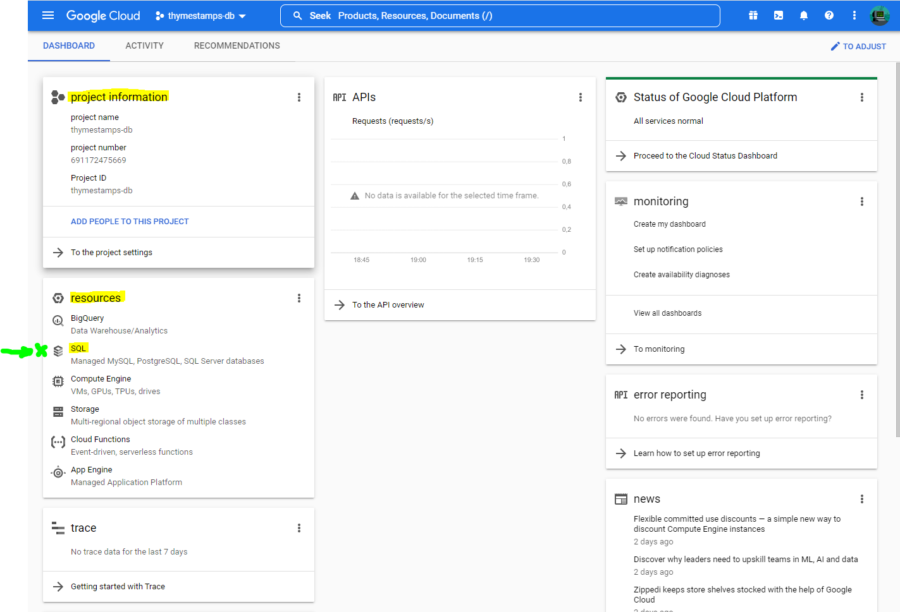</td>
   </tr> 
   <tr>
    <td><b>8.</b></td>
    <td>A graphic will appear in the middle of the page with a short explanation of what <b>Cloud SQL Instances</b> are. Click on <b>Create Instance</b>.</td>
    <td>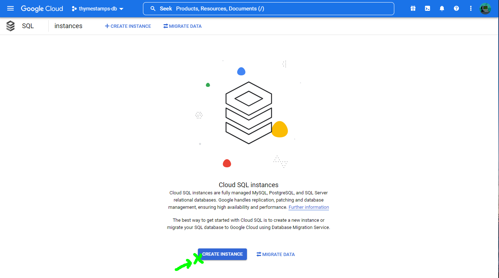</td>
   </tr>
   <tr>
    <td rowspan="2" style="vertical-align: top; padding-top: 20px;"><b>9.</b></td>
    <td>Choose <b>Postgresql</b>.</td>
    <td></td>
   </tr>
   <tr>
    <td>When asked to enable computer engine API please click on <b>Enable API</b> to continue. This could take a couple of minutes.</td>
    <td>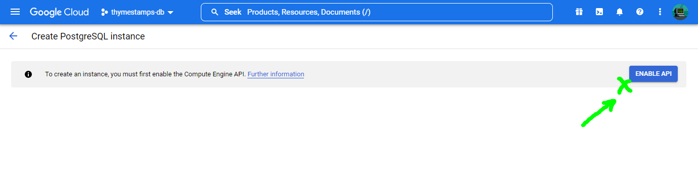</td>
   </tr>
   <tr>
    <td rowspan="4" style="vertical-align: top"><b>10.</b></td>
    <td>Now on the <b>Create a PostgreSQL Instance</b> page, fill out the form as follows:
      <li>Enter arbitrary instance ID 
      <li>Enter a password and please note it down. It will be needed when logging into the database! 
      <li>Leave version of DB as is
      <li>Select a region. The closer the region the less power used, i.e. <b>europe-west3 (Frankfurt)</b> 
      <li>Click on <b>SHOW CONFIGURATION OPTIONS</b>
    </td>
    <td>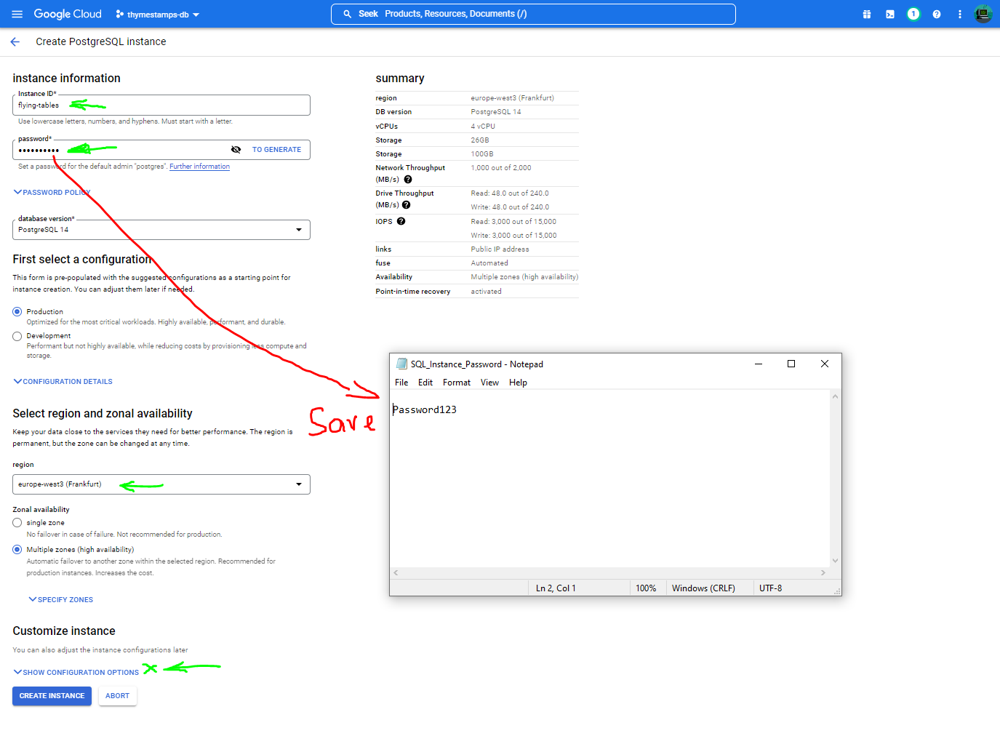</td>
   </tr>
   <tr>
    <td>
      <li><font color="red">Important! :</font> In the <b>Machine type</b> dropdown menu select <b>Lightweight</b> and <b>1vCPU, 3.74 GB</b>.
      <li>Finally click on <b>CREATE INSTANCE</b>. This could take up to a few minutes. 
    </td>
    <td>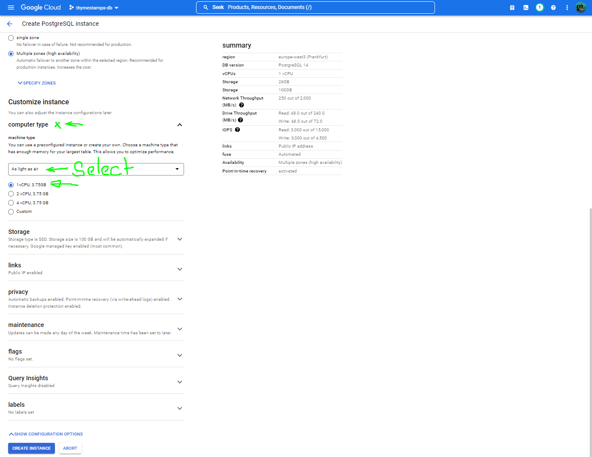</td>
   </tr> 
   <tr>
    <td>wait for it...</td>
    <td>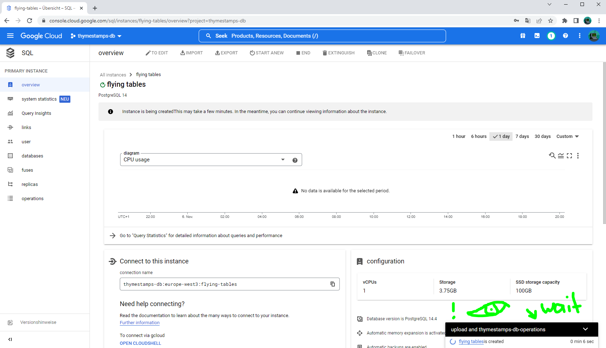</td>
   </tr>
   <tr>
    <td>done.</td>
    <td>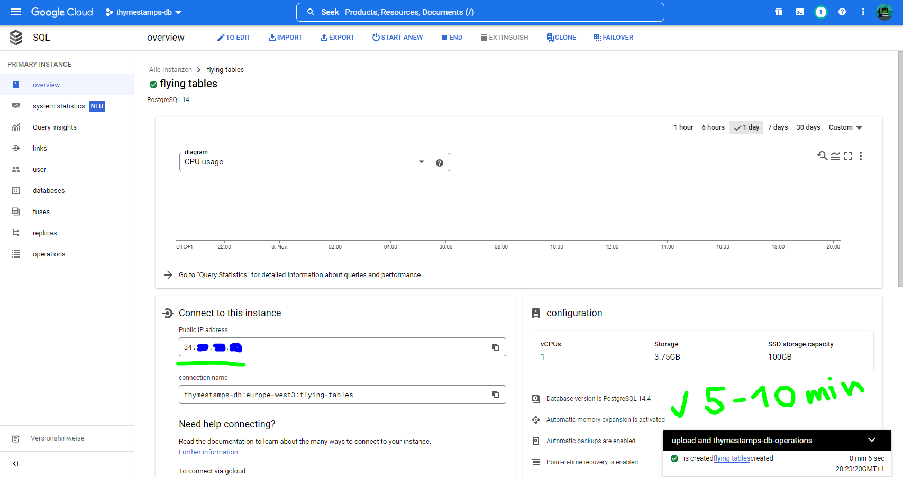</td>
   </tr>
   <tr>
    <td><b>11.</b></td>
    <td>Once the database is being created you will be sent to the DB dashboard. On the left there will be a menu titled <b>PRIMARY INSTANCE</b>. As soon as your db is successfully created, click on <b>Connections</b>.</td>
    <td>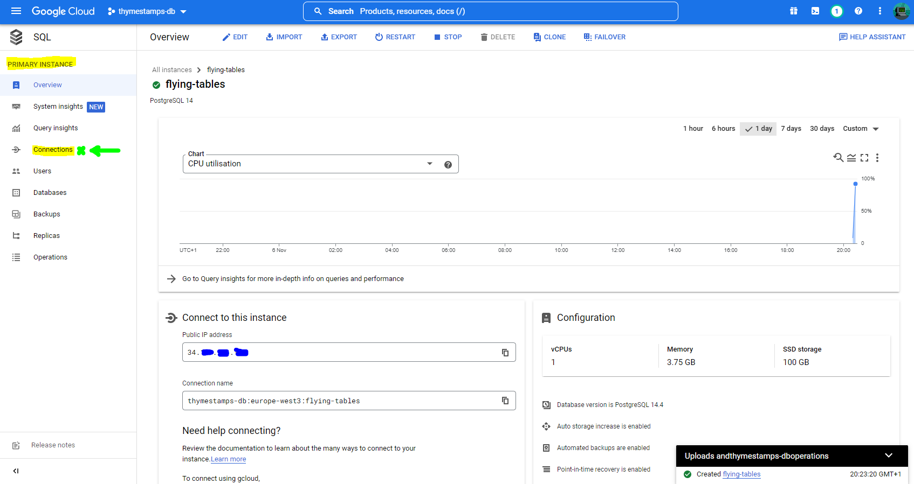</td>
   </tr> 
   <tr>
    <td><b>12.</b></td>
    <td>Under the <b>NETWORKING</b> tab ensure that <b>Public IP</b> is selected. Under <b>Authorized networks</b> click on <b>ADD NETWORK</b>.</td>
    <td>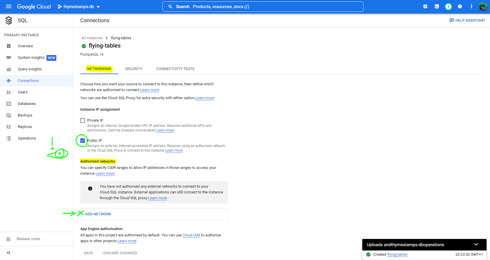</td>
   </tr>
   <tr>
    <td rowspan="2" style="vertical-align: top"><b>13.</b></td>
    <td>Here access to the database is defined. Add `0.0.0.0/0`  as the authorized network so the DB can be accessed from anywhere.</td>
    <td>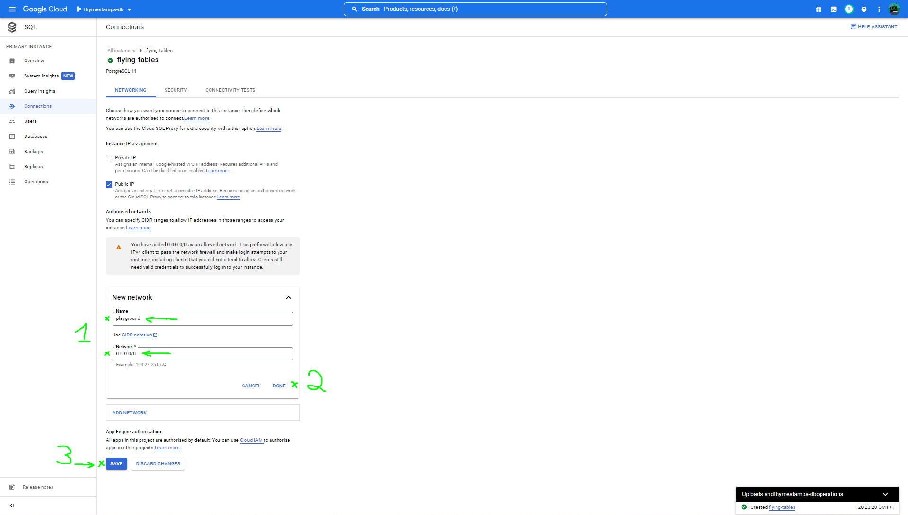</td>
   </tr>
   <tr>
    <td> wait again...</td>
    <td>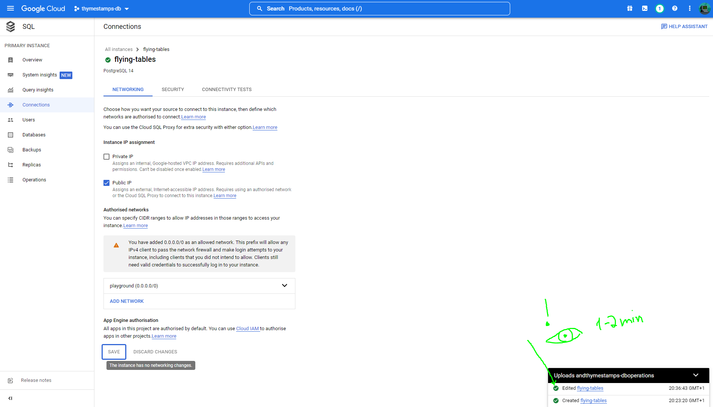</td>
   </tr>
   <tr>
    <td rowspan="2" style="vertical-align: top"><b>14.</b></td>
    <td>Make sure to click on <b>DONE</b> and <b>SAVE</b> to complete the authentication.<br><br> <b>!!!</b> Make sure that you know the database connection details:<br>
      <li>public hostname/ ip-address/ endpoint</td>
    <td>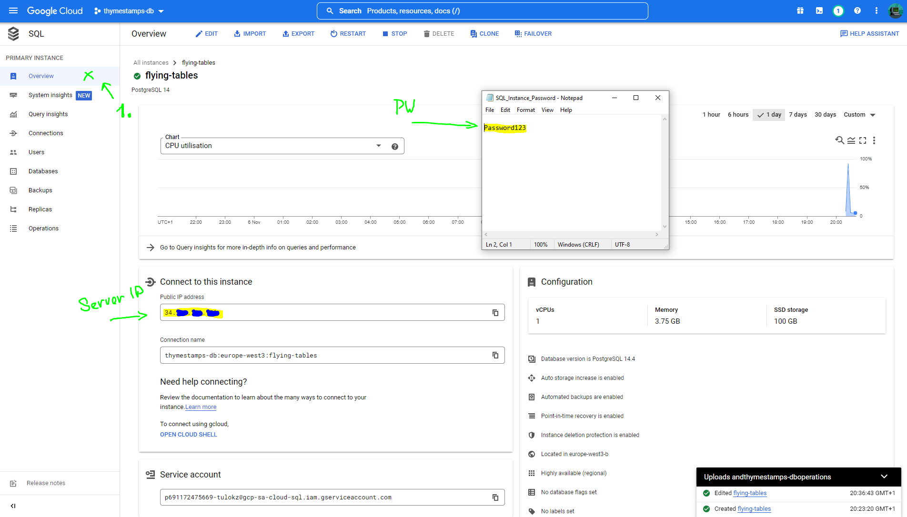</td>
   </tr>
   <tr>
    <td>
      <li>database username<br>
      <li>database password</td>
    <td>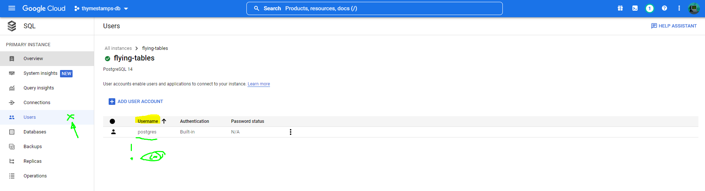</td>
   </tr>
</table>

{}

{}

More information about Postgresql on GCP can be found at the following link:

- googlecloud postgresql tutorial: [https://www.youtube.com/watch?v=wAV0KbrKXF8](https://www.youtube.com/watch?v=wAV0KbrKXF8)

{}

**PSQL Client**

There are many different ways to interface with databases, but they are all refered to as **clients**. The database is running on a server and the client is used to interact with the database. **PSQL** is the standard command line client, maintained by the postgresql development group and typically distributed as part of the server installation. 

{}

**Linux**

```shell
sudo apt-get update
```

```shell
sudo apt-get install postgresql-client
```

To ensure installation was successful run the following command in the terminal. A newly started terminal may be necessary:

```shell
psql --version
```

**Mac**

If not already installed please install **brew**. [How to install brew link](https://phoenixnap.com/kb/install-homebrew-on-mac)

Once **brew** has been installed then enter the following commands into the power terminal:

```shell
brew doctor
```

```shell
brew update
```

```shell
brew install libpq
```

```shell
brew link --force libpq
```

To ensure installation was successful run the following command in the terminal. A newly started terminal may be necessary:

```shell
psql --version
```

**Windows**

- Download installer from **postgresql** website: [https://www.postgresql.org/download/windows/](https://www.postgresql.org/download/windows/)

- **ONLY** install **command line tools** when prompted to select installion files.

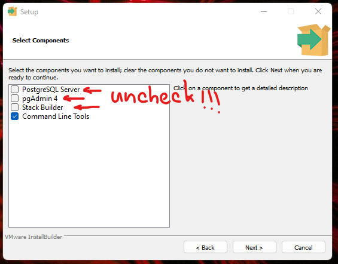

After the installation, you should be able to run psql. Check by typing into the terminal:

```
psql --version
```

it should return the installed version of psql, i.e. `psql (PostgreSQL) 15.1`


{}
- If you get a “Command not found” error after running psql, the command line interface for Postgres, by typing psql in the terminal, that means, although psql is installed, the terminal does not know where to find the program. You can fix this by updating your PATH environment variable to include the path to psql.

- To do this, you first have to know where psql is. Your Postgres installation is usually in your Program Files directory and psql will be in a subdirectory of a subdirectory of that:

```
C:\Program Files\PostgreSQL\15\bin
```

- This directory should be named “bin” and will contain lots of stuff besides psql, including programs named “createuser” and “createdb.” You will have to fish around with Windows Explorer to find bin. Once you do, you should copy the path to your clipboard.


To use psql in a terminal open the windows command prompt (CMD) and modify the PATH variable. In the below command, replace C:\Program Files\PostgreSQL\15\bin with the file path to your installation directory of PostgreSQL:

```
setx path "%path%;C:\Program Files\PostgreSQL\15\bin"
```

After restarting your computer, you should be able to run psql. Check by typing into the terminal:

```
psql --version
```
{}

{}

## Connecting to a database

In order to connect to a database several vital pieces of information are necessary: 

Each person that has been allowed access to the database has a **username** that will be needed in order to connect. This username will in turn have a **password**. 

The server that is **hosting** the database has a specific **ip address**. This is like someone's home address. It is unique to that server which allows the client to find it easily. 

The connection from client to sever runs through a so-called **port**. Each computer whether it be a laptop or a server has many ports. Information is exchanged using these ports. For example on port **80** information is sent and recieved to render websites so users can access them in the browser. **Posrtgresql** runs on port **5432** by default. 

{}

- Open power terminal in VS Code.
- Use `psql` command to connect. The following arguments will be necessary:
  - `-U [username]`: Unless a user has been created the default name `postgres` can be used to log in.
  - `-h [hostname]`: The hostname is the IP address of the database instance the user wants to connect to. This can be found on the database page in the google cloud account. 
  - `-p [port]`: A port number is a way to identify a specific application to which an internet or other network message is to be forwarded when it arrives at a computer/server. `5432` is the defualt for **postgresql**.

Enter the following command in the terminal with all the appropriate credentials:

```shell
psql -U postgres -h 127.87.55.11 -p 5432
```

At this point you should be asked for the password to access the database and upon a successful login a prompt similar to this will be in the terminal:
```
postgres=>
```

{}

Note: If you want to come back to your regular prompt you can type in the psql console `\q`. This will take you back to the regular shell. We will learn more about other psql shell commands in the next encounter.

{}

Here are some other psql command line arguments that may come in handy:

Argument short | Argument long | Description
---|---|---|
  -c | --command=COMMAND  | run only single command (SQL or internal) and exit
  -d | --dbname=DBNAME    |  database name to connect to (default: "samuel")
  -f | --file=FILENAME  |    execute commands from file, then exit
  -l | --list          |     list available databases, then exit
  -V | --version        |    output version information, then exit

{}

{}

- [Postgres Tutorial](https://www.postgresqltutorial.com)
- [How to install psql on different operating systems](https://blog.timescale.com/blog/how-to-install-psql-on-mac-ubuntu-debian-windows/)

{}

<br>

{}

This work is licensed under a [Creative Commons Attribution-ShareAlike 4.0 International License](https://creativecommons.org/licenses/by-sa/4.0/). It is a derivative of [academis.eu/posts/spiele_DE/textadventure.md](https://www.academis.eu/posts/games_EN/textadventure.md) by Dr. Kristian Rother, used under CC-BY-SA 4.0. 

{}